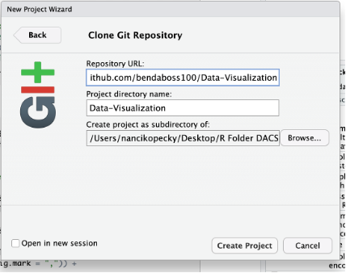

**How to Connect with Group 2 Project**

1)  Download R and R Studio

2)  Install git

    -   <https://www.youtube.com/watch?v=pqWiwcfFz28&t=5s>

3)  Open R Studio

4)  Select File \> New Project \> Version Control \> Git

5)  Fill out git prompts (copy and paste git url, see below)

    -   <https://github.com/bendaboss100/Data-Visualization>

    -   

6)  Select Create Project
